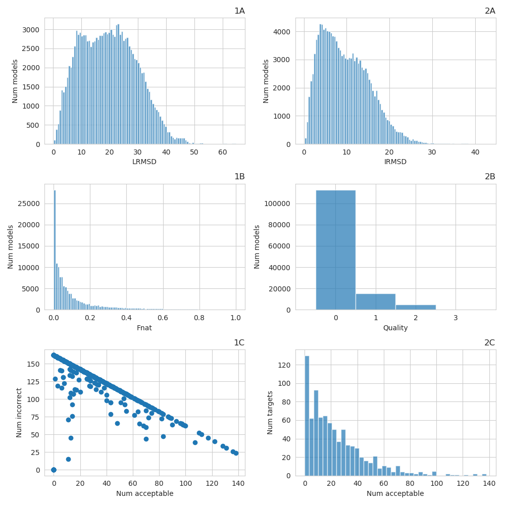
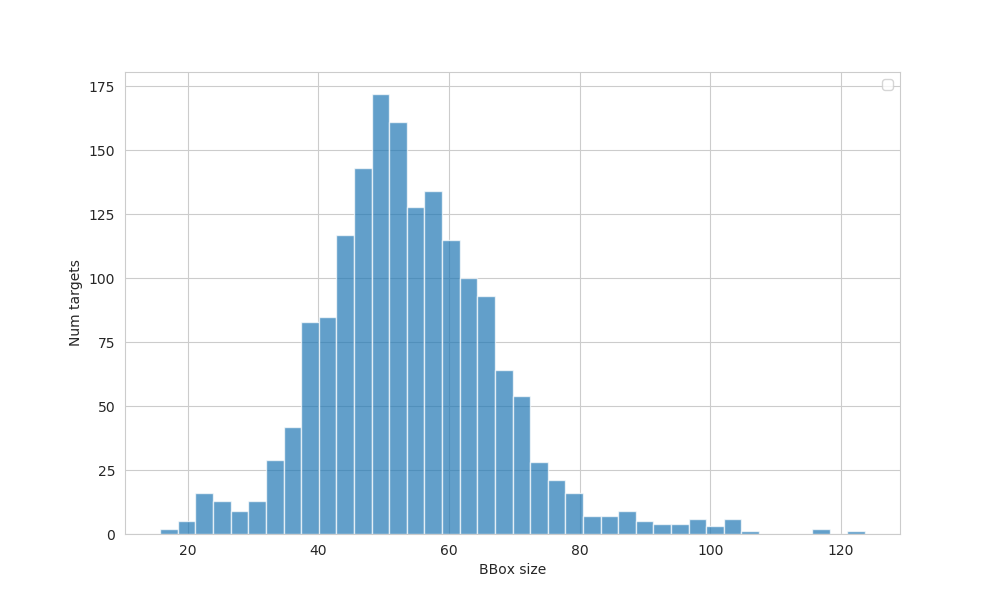

# Dataset construction scripts
Unfortunately, the dataset of decoys is around 40-50 Gb after compression, therefore we share the scripts for decoys generation instead of the dataset itself.
Here we describe the generation workflow and how to run it.

# Downloading the initial structures
The script *download.py* downloads the structures from the pdb database. It needs two files: *hetero.txt* and *homo.txt* which contain heterodimers ids and homodimers. 

# Generating decoys

## Prerequisites

The script *processing.py* contains all the procedures needed to generate decoys. It relies on three external programs:
1. NOLB for generating perturbations of single chains (https://team.inria.fr/nano-d/software/nolb-normal-modes/)
2. HEX for docking generated chains (http://hex.loria.fr/)
3. TMScore for measuring the RMSD (https://zhanglab.ccmb.med.umich.edu/TM-score/)
4. ProFIT for measuring I-RMSD and L-RMSD (http://www.bioinf.org.uk/software/profit/index.html)

The functions that call these programs are found in *processing_utils.py*. As one can see from this file, one should put TMScore and NOLB executables in the utils directory (*processing_utils.py* line 24, 99). In the case of HEX one should install it globally (*processing_utils.py* line 142).
For ProFIT the directory of the executable can be changed in the file *profit.py* line 8.

## Running processing

After installing and setting up prerequisites, the main workflow to run is *processing.py*.
The main steps of the worflow are:
1. Splitting the chains in the downloaded pdb structures
2. Generating perturbations of the split chains using NOLB
3. Docking perturbed chains into one complex using HEX
4. Measuring quality of the generated complexes
5. Splitting the docked complexes again into separate files

We used two iterations of the workflow, first to generate near-native decoys and the second to generate non-native ones.

# Analisys

To analise the generated dataset we used the script *analisys.py*. It plots quality of decoys distribution, distribution of bounding box sizes of chains *etc.*

An example of quality distributions output:

An example of bounding box size distributions output:

# Train/Val split

After running the *analisys.py* script it will generate exclusion lists, based on the number of near-native decoys and bounding boxes. To exclude them from the dataset, as well as split the dataset into validation and training subsets we use *make_dataset_split.py* script.

# Docking Benchmark

To evaluate the models we used DockingBenchamrkV4. This benchmark contains unbound and bound protein structures, however, the chain naming in these two structures are different. We matched the chains in bound and unbound structures by aligning their sequences using *benchmark_cleanup.py* script. This script depends on *global_alignment.py* script. 

Preparations:

1. Download the benchmark
2. Save benchmark desciption table as *.csv* file

The workflow of the script:

1. Read benchmark table (TableS1.csv for BenchamrkV4, Table_BM5.csv for BenchmarkV5), line 230

2. Generate chains alignment, line 241

3. Merge chains into one file and write them into benchmark directory/Matched, line 245

In case one wants to evaluate only a subset of a benchmark (for example exclude proteins with the bbox size > 80A) one can use the script *make_benchmark_split.py*. It generates exclusion lists and writes a new benchmark description table (line 90)

