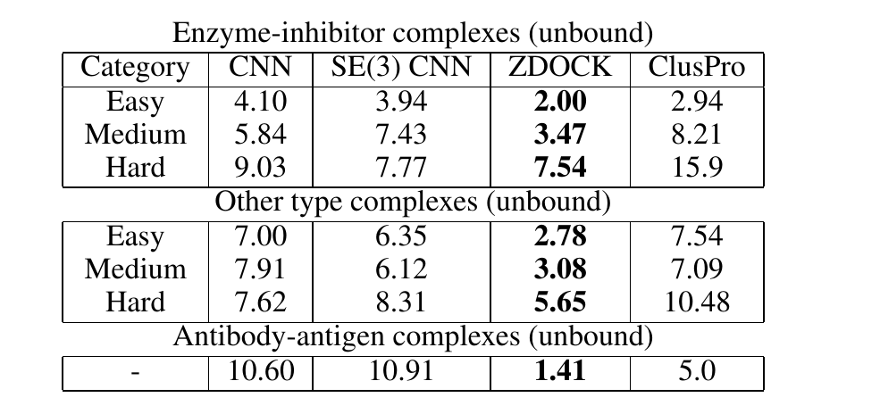
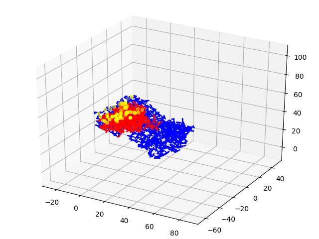
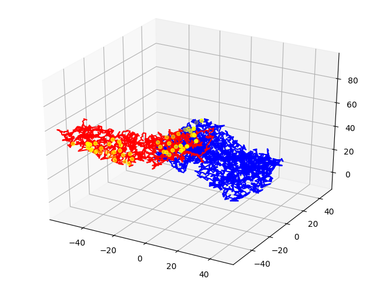
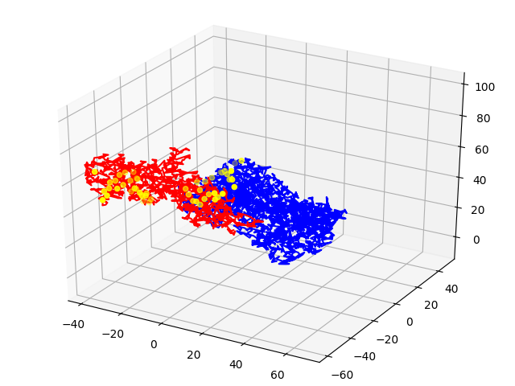
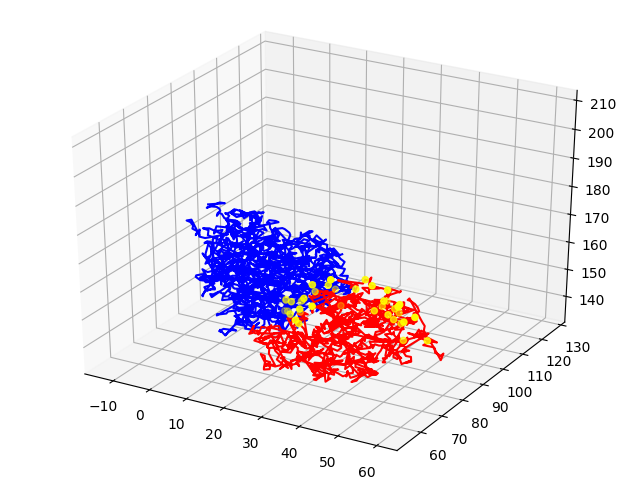
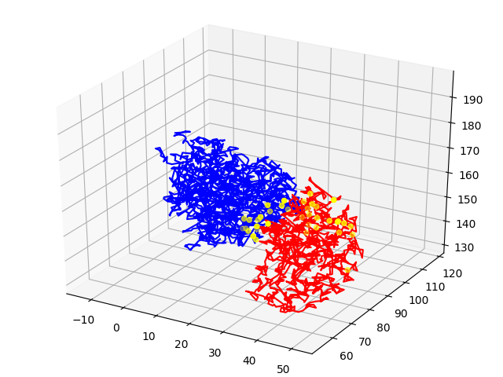
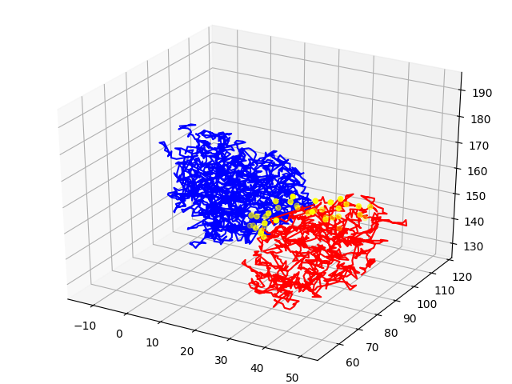

# DockingBenchmark

This folder contains scripts and classes for evaluating decoys on the DockingBenchmarkV4 against ZDOCK.

## Requirements
1. [Ananas tool](https://team.inria.fr/nano-d/software/ananas/)
2. [Docking Benchmark V4](https://zlab.umassmed.edu/benchmark/benchmark4.html)
3. [ZDOCK results](https://zlab.umassmed.edu/zdock/decoys_bm4_zd3.0.2_15deg.tar.gz)

## Preparation
Turn out the benchmark is not completely processed and contains multiple errors.

### Benchmark
First, save TableS1.xls as TableS1.csv with tabular separator. Then, make the following changes to the targets:
1. Delete 1QFW_HL 
2. Add 3LZT_A chain to the target 2I25_ 
3. Delete 1OYV_B:I
4. Add 1UCH_A to 1XD3 
5. Add 1L6P_A to 1Z5Y 
6. Add 1MH1_A to 2H7V
7. Add 1MH1_A to 2NZ8
8. Change the wrong chain in unbound ligand 1G16_C for 3CPH
9. Swap 1JMO_l_b.pdb H and L chains in the structure

### Directories
In the script *EvaluateBenchmark.py* we use the same directory signature for our output conformations and ZDOCK output conformations. Make the appropriate directories for ZDOCK experiment and place decoys in *DockingBenchmarkV4_15300.0* directory. For more details see the evaluation script.

## Evaluation
The script we used to evaluate all the experiments and ZDOCK is *run.sh*. This evaluation takes into account symmetries of the target ligand and receptor. The complete explanation of the algorithm is quite cumbersome, we will write it later.

## Results

The benchmark table for all the models should have numbers similar to these:

Some decoys for ZDOCK (1AHW, 1BVK):

### ZDOCK 1AHW

### ZDOCK 1BVK

