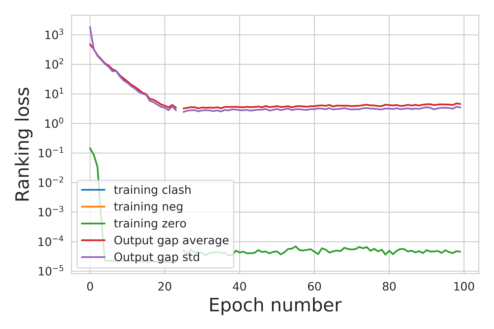

# Plotting the results

# Training curves
To plot training curve one has to run script *scripts/Results/PlotTraining.py*. The generated loss curve example:

To plot addtional losses, comment the line 167 and change the arguments in the file *PlotTraining.py*. An example output should look like:

The training_neg loss is almost always zero, therefore we can't see it on the log-plot. Output gap indicates the difference in ranking scores between positive and negative examples.

# Benchmark results
The benchmark results can be computed using script *scripts/Results/PlotBenchmark.py*. This script is quite a mess, sorry for this.

It does few things:
1. Clusters decoys (output is in the directory *Complexes_<experiment_name>*)
2. Measures lrmsd of the top 2000 decoys
3. Measures the quality of clusters

In the paper we do not use clustering and instead only second step is useful. Take into account, that DockerParser returns lrmsd for all 2000 generated conformations, but
in the table we take the minimum of the first 1000 only (line 326 *PlotBenchmark.py*).

This scripts outputs many things, but the paper shows the comparison with ClusPro only. The table in the end should look like this:

|Rigid           	|Medium           	|Difficult |
|------------------:|------------------:|---------:|
||__AB__||
|11.961678, 55.571429| | |	
||__E__||
|3.977806, 480.974359|	6.258567, 339.500000|	6.874775, 197.400000|
||__O__||
|7.098093, 192.510204|	5.932915, 231.529412|	9.614210, 94.800000	|

First number is average minimum I-RMSD among top 1000 results, second is average number of hits among to 1000 results.